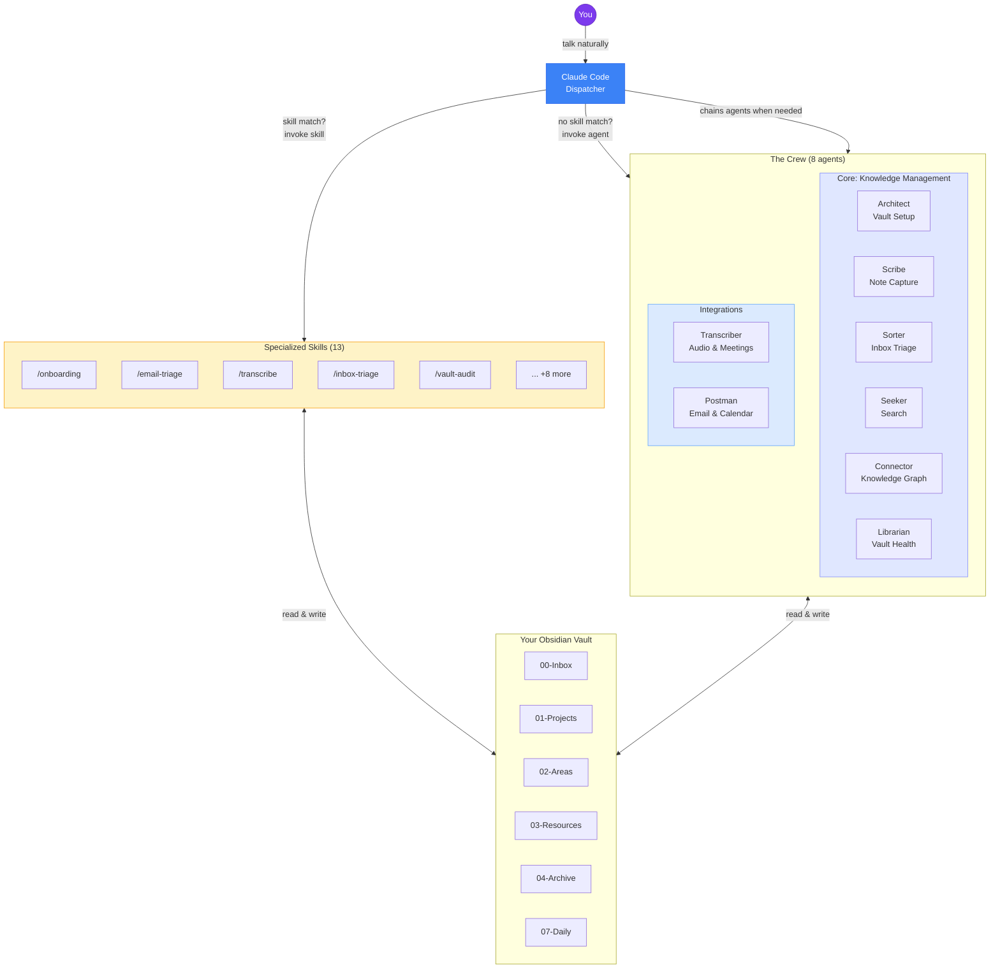
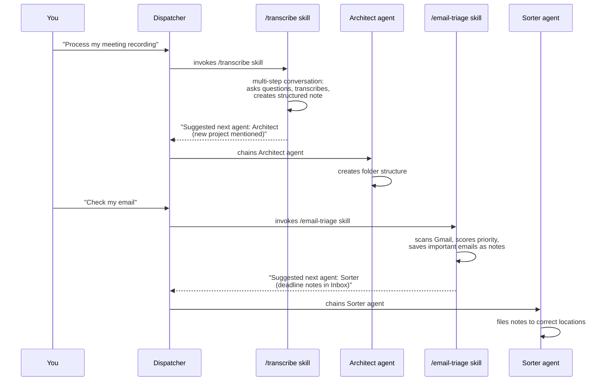

<h1 align="center">🧠 My Brain Is Full — Crew</h1>

<p align="center">
  <strong>A team of 8+ AI agents and 13 specialized skills that manage your Obsidian vault<br>so your brain doesn't have to.</strong>
</p>

<p align="center">
  You talk. They organize, file, connect, search, transcribe, and triage your email. In any language.
</p>

<p align="center">
  <a href="https://discord.gg/EUnQmABw8s">
    
  </a>
</p>

<p align="center">
  
  
  
  
  
</p>

---

## The honest origin story

I'm a PhD researcher. I've spent years training my brain to hold enormous amounts of information: papers, ideas, deadlines, people, half-baked theories at 2am. And for a while, it worked.

Then it didn't.

Memory started slipping. Not dramatically (no diagnosis, no crisis) just the slow, creeping realization that the mental budget was getting empty, and things were falling through the cracks. I'd forget what I'd read. Lose track of conversations. Feel constantly behind, constantly overwhelmed.

I started looking for solutions. I found a lot of Obsidian + Claude setups online. They were mostly clever note-capture tools, glorified search engines for your second brain. Useful. But not what I needed.

What I needed wasn't just a memory extension. I needed a **brain dump system**, something that could help me organize not just my knowledge, but my life: my overwhelmed mind, my wrecked physical health, the avalanche of emails and commitments and things I should have done last week.

So I built this.

---

## What makes this different

Most "AI + Obsidian" tools are built for **people who already have their life together** and want to optimize. This one is for people who are **drowning** and need a lifeline.

**1. The chat IS the interface.**
I don't browse Obsidian. I don't drag files around. I don't maintain complex folder structures manually. I just talk to Claude. Everything else happens automatically.

**2. It speaks your language, literally.**
The system works in any language. You shouldn't need to think in English to manage your brain. Just talk in Italian, French, German, Spanish, Japanese, whatever feels natural. The agents match you.

**3. The agents coordinate through a dispatcher.**
When the transcription agent processes a meeting and discovers a new project, the dispatcher automatically chains the Architect to create the folder structure. It's a crew, not a collection of isolated tools.

**4. 8 agents are just the starting point. Build your own.**
The crew ships with 8 agents. But your life isn't generic, and your system shouldn't be either. Say "create a new agent" and the Architect walks you through a conversation to design one from scratch. No code, no config files, no templates to edit. You describe what you need, it builds it.

| Your problem | Your agent |
|---|---|
| *"I can only spend 300 euros a month on groceries and I keep losing track"* | **budget-tracker**: monitors spending notes, flags when you're close to the limit |
| *"My partner says I dress like I pick clothes with my eyes closed"* | **wardrobe-coach**: tracks what you own, suggests outfits from your notes, and gently stops you from wearing that shirt again |
| *"I keep buying the same thing at IKEA because I forget what I already have at home"* | **home-inventory**: catalogs what you own room by room, saves you from your third identical cutting board |
| *"I keep starting side projects and abandoning them"* | **project-pulse**: weekly check-in on all active projects, flags stale ones |
| *"I have three freelance clients and I mix up their deadlines"* | **client-tracker**: aggregates deadlines per client from notes and calendar |

Custom agents coordinate with the core crew, get discovered automatically by Claude Code, and respond in your language. They just solve the problems that are specific to **your** life.

> **Your custom agents, your responsibility.** Custom agents are created by you and run on your data. The project provides no warranty on their behavior. See [Terms of Use](TERMS_OF_USE.md).

---

## Who this is for

- PhD students, researchers, academics drowning in papers and commitments
- Anyone with **brain fog**, or just an overloaded working memory
- Non-native English speakers who want a system that works in their language
- Anyone who's tried Obsidian before and gave up because it felt like a second job

If you've ever thought *"I need to get organized, but I'm too exhausted to get organized"*, this is for you.

---

## Important disclaimers

> **Please read the [full disclaimers](docs/DISCLAIMERS.md) before using this project.**

Key points:

- **This software is for personal use on your own data.** You are responsible for GDPR/CCPA compliance if you process third-party data (e.g., emails containing other people's information).
- **No warranty.** Provided "as is". Back up your vault. The author accepts no liability.
- **No responsibility for forks or misuse.** This is a personal productivity tool. Malicious repurposing is explicitly condemned.

> **By using this software, you agree to the [Terms of Use](TERMS_OF_USE.md).** During onboarding, the Architect will ask you to explicitly accept these terms before proceeding.

---

## The Crew

| # | Agent | Role | Superpower |
|---|-------|------|------------|
| 1 | **Architect** | Vault Structure & Setup | Designs your entire vault, runs onboarding, sets the rules everyone follows |
| 2 | **Scribe** | Text Capture | Transforms your messy, typo-filled, stream-of-consciousness dumps into clean notes |
| 3 | **Sorter** | Inbox Triage | Empties your inbox every evening and routes every note to its perfect home |
| 4 | **Seeker** | Search & Intelligence | Finds anything in your vault, synthesizes answers across notes with citations |
| 5 | **Connector** | Knowledge Graph | Discovers hidden links between your notes, even ones you'd never think of |
| 6 | **Librarian** | Vault Maintenance | Weekly health checks, deduplication, broken link repair, growth analytics |
| 7 | **Transcriber** | Audio & Meetings | Turns recordings and transcripts into rich, structured meeting notes |
| 8 | **Postman** | Email & Calendar | Bridges email (Gmail or Hey.com) and Google Calendar with your vault: deadline radar, meeting prep |

> **Agents + Skills = the full system.** Each agent handles quick, reactive tasks. For complex multi-step workflows (like onboarding, email triage, or vault audits), the dispatcher routes to one of **13 specialized skills** that run as guided conversations. See the [Skills](#skills) section below.

---

## Skills

Skills handle the complex, multi-step workflows that need conversational context. While agents are great for quick, one-shot tasks, some operations — like onboarding or email triage — require a back-and-forth conversation. Skills run in the main conversation context, so they can ask questions, wait for answers, and maintain state naturally.

The dispatcher automatically routes your message to the right skill or agent. You don't need to remember which is which.

| Skill | What it does | Extracted from |
|-------|-------------|----------------|
| `/onboarding` | Full vault setup conversation | Architect |
| `/create-agent` | Design a custom agent step by step | Architect |
| `/manage-agent` | Edit, remove, or list custom agents | Architect |
| `/defrag` | Weekly vault defragmentation (5 phases) | Architect |
| `/email-triage` | Scan and prioritize unread emails | Postman |
| `/meeting-prep` | Comprehensive meeting brief | Postman |
| `/weekly-agenda` | Day-by-day week overview | Postman |
| `/deadline-radar` | Unified deadline timeline | Postman |
| `/transcribe` | Process recordings into structured notes | Transcriber |
| `/vault-audit` | Full 7-phase vault audit | Librarian |
| `/deep-clean` | Extended vault cleanup | Librarian |
| `/tag-garden` | Tag analysis and cleanup | Librarian |
| `/inbox-triage` | Process and route inbox notes | Sorter |

---

## How it works

```
You talk to Claude  →  Dispatcher checks skills first  →  If match: invokes skill
                                                         →  If no match: invokes agent  →  Your vault gets updated
```

The dispatcher has two delegation mechanisms. **Skills** handle complex, multi-step conversational flows (onboarding, email triage, vault audits). **Agents** handle quick, reactive single-shot operations (capture a note, search the vault, create a folder). Skills are checked first because they cover the most involved workflows. If no skill matches, the dispatcher falls through to agents.

Each crew member is an isolated AI with its own system prompt, tool restrictions, and model assignment. You clone the repo into your vault, run a setup script, and from that moment on you manage everything through conversation. No GUI, no drag-and-drop, no manual file management.

### Architecture



### Agent & Skill Coordination Flow



### Works on both Claude Code CLI and Claude Code Desktop (Cowork)

The installer sets up **two parallel layers** so the Crew works everywhere:

| Layer | Location | Purpose |
|-------|----------|---------|
| **Agents** | `.claude/agents/` | Lightweight reactive agents for single-shot tasks (capture, search, create) |
| **Skills** | `.claude/skills/` | Specialized multi-step flows for complex tasks (onboarding, triage, audits) |

Both layers work on CLI and Desktop. `launchme.sh` installs both automatically. The dispatcher decides whether to invoke a skill or an agent based on your message.

Your vault follows a hybrid **PARA + Zettelkasten** structure. These are the default folder names — if you already have a vault with different names, the Crew adapts to yours during onboarding (see [Vault Mapping](docs/vault-mapping.md)):

```
00-Inbox/          Capture everything here first
01-Projects/       Active projects with deadlines
02-Areas/          Ongoing responsibilities
03-Resources/      Reference material, guides, how-tos
04-Archive/        Completed or historical content
05-People/         Your personal CRM
06-Meetings/       Timestamped meeting notes
07-Daily/          Daily notes and journals
MOC/               Maps of Content (thematic indexes)
Templates/         Obsidian note templates
Meta/              Vault config, agent logs, health reports
```

---

## Quick start

> **Prerequisite**: You need [Claude Code](https://claude.ai/code) with a Claude Pro, Max, or Team subscription, and [Obsidian](https://obsidian.md) (free).

### 1. Create your Obsidian vault

Open Obsidian and create a new vault (or use an existing one).

### 2. Clone the repo inside your vault

```bash
cd /path/to/your-vault
git clone https://github.com/gnekt/My-Brain-Is-Full-Crew.git
```

### 3. Run the installer

```bash
cd My-Brain-Is-Full-Crew
bash scripts/launchme.sh
```

The script asks a couple of questions and copies the agents and skills into your vault's `.claude/` directory. That's it. When Claude Code is open in your vault folder, the agents activate automatically. When you're in any other project, they don't.

> **Never used a terminal before?** See the [step-by-step guide for beginners](docs/getting-started.md). It walks you through everything, or just show this page to a tech-savvy friend. It takes 60 seconds.

### 4. Initialize

Open Claude Code **inside your vault folder** and say:

> **"Initialize my vault"**

The `/onboarding` skill starts a friendly guided conversation:

1. **Who are you?** Name, language, role, what brought you here
2. **What do you need?** Which agents to activate, which areas of life to manage
3. **Integrations** Gmail and Google Calendar connections

After onboarding, the Architect generates `Meta/vault-map.md` (mapping your folder names to the Crew's internal tokens), creates your entire vault folder structure, saves your profile, leaves you a welcome note, and you're ready to go. If you already have an existing vault, the Architect scans your folders and adapts — no renaming needed.

### 5. Start using it

| You say | What happens |
|---------|-------------|
| *"Save this: meeting with Marco about the Q3 budget, he wants the report by Friday"* | **Scribe** agent captures it as a clean note with tasks, wikilinks, and deadline |
| *"Triage my inbox"* | `/inbox-triage` skill files everything, updates MOCs, gives you a summary |
| *"What did we decide about the pricing strategy?"* | **Seeker** agent searches your vault, synthesizes the answer with source citations |
| *"Check my email"* | `/email-triage` skill scans Gmail, saves important emails, flags deadlines |
| *"Weekly review"* | `/vault-audit` skill runs a full vault audit: broken links, duplicates, health score |
| *"Find connections for my latest note"* | **Connector** agent discovers hidden links to other notes in your vault |

---

## Works in any language

The Crew is built in English but **responds in whatever language you write in**. Italian, French, Spanish, German, Portuguese, Japanese: just talk, and the agents match you.

```
"Salva questa nota veloce..."          → Scribe responds in Italian
"Vérifie mon email..."                 → Postman responds in French
"Was habe ich diese Woche geplant?"    → Seeker responds in German
"Check my inbox"                       → Sorter responds in English
```

No translations to install. No language packs. It just works.

---

## Works from your phone too

You can control the Crew from your phone using Claude Code's **Remote Control** feature. Your computer runs Claude Code locally (with full vault and agent access), and your phone acts as a remote interface through the browser or the Claude mobile app.

Capture a quick thought on a walk. Check your email from the couch. Search your vault from the supermarket. Everything runs on your computer; your phone is just the remote.

> **[Full setup guide](docs/mobile-access.md)** (takes 2 minutes)

---

## Agent coordination

Agents coordinate through a dispatcher-driven orchestration system. When an agent or skill finishes its task and detects work for another agent, it signals the dispatcher via a `### Suggested next agent` section in its output. The dispatcher reads this and automatically chains the next agent:

- The `/transcribe` skill processes a meeting that introduces a new project -- the dispatcher chains the **Architect** to create the folder structure
- The `/email-triage` skill finds emails about deadlines -- the dispatcher chains the **Sorter** to file them
- The **Connector** finds orphan notes -- the dispatcher chains the **Librarian** to investigate
- The **Sorter** finds notes that belong to a new area -- the dispatcher chains the **Architect** to build it

No agent works in isolation. The crew is greater than the sum of its parts.

---

## Required integrations

The **Postman** agent (and its related skills: `/email-triage`, `/meeting-prep`, `/weekly-agenda`, `/deadline-radar`) requires one of:
- **Google Workspace CLI** (`gws`) — full read/write access to Gmail and Google Calendar: search, read, archive, delete, label, send emails; create/update/delete calendar events. See [`docs/gws-setup-guide.md`](docs/gws-setup-guide.md) for setup.
- **Hey CLI** (`hey`) — for Hey.com accounts. Read/reply/compose emails, leverages Hey's pre-sorted mailboxes (Imbox, Feed, Paper Trail, Reply Later, Set Aside, Bubble Up). Calendar operations still use `gws`. See [Hey CLI](https://github.com/basecamp/hey-cli) for installation.
- **MCP connectors** (read-only fallback) — `launchme.sh` offers to set up `.mcp.json` automatically. Limited to reading emails and calendar events, plus draft creation.

You can use `gws` and `hey` simultaneously if you have both Gmail and Hey.com accounts. All other agents and skills work with just your local Obsidian vault. No integrations needed.

### Updating

After pulling new changes from the repo:

```bash
cd /path/to/your-vault/My-Brain-Is-Full-Crew
git pull
bash scripts/updateme.sh
```

Only changed files are updated. Your vault notes are never touched.

---

## Recommended Obsidian plugins

**Essential:** Templater, Dataview, Calendar, Tasks

**Recommended:** QuickAdd, Folder Notes, Tag Wrangler, Natural Language Dates, Periodic Notes, Omnisearch, Linter

---

## Project structure

```
My-Brain-Is-Full-Crew/               ← cloned inside your vault
├── agents/                          The 8 core agents
│   ├── architect.md                   Vault setup & onboarding
│   ├── scribe.md                      Text capture & note creation
│   ├── sorter.md                      Inbox triage & filing
│   ├── seeker.md                      Search & knowledge retrieval
│   ├── connector.md                   Knowledge graph & link analysis
│   ├── librarian.md                   Vault health & maintenance
│   ├── transcriber.md                 Audio & meeting transcription
│   └── postman.md                     Email & calendar integration
├── skills/                          The 13 specialized skills
│   ├── onboarding/SKILL.md            Full vault setup conversation
│   ├── create-agent/SKILL.md          Design a custom agent step by step
│   ├── manage-agent/SKILL.md          Edit, remove, or list custom agents
│   ├── defrag/SKILL.md                Weekly vault defragmentation
│   ├── email-triage/SKILL.md          Scan and prioritize unread emails
│   ├── meeting-prep/SKILL.md          Comprehensive meeting brief
│   ├── weekly-agenda/SKILL.md         Day-by-day week overview
│   ├── deadline-radar/SKILL.md        Unified deadline timeline
│   ├── transcribe/SKILL.md            Process recordings into structured notes
│   ├── vault-audit/SKILL.md           Full 7-phase vault audit
│   ├── deep-clean/SKILL.md            Extended vault cleanup
│   ├── tag-garden/SKILL.md            Tag analysis and cleanup
│   └── inbox-triage/SKILL.md          Process and route inbox notes
├── references/                      Shared agent documentation
├── scripts/
│   ├── launchme.sh                    First-time installer
│   └── updateme.sh                    Post-pull updater
├── docs/                            User-facing documentation
│   ├── getting-started.md             Step-by-step setup guide
│   ├── examples.md                    Real-world usage examples
│   ├── vault-mapping.md               Vault path tokenization guide
│   └── agents/                        Deep-dive into each agent
├── .mcp.json                        MCP servers — read-only fallback (see docs/gws-setup-guide.md for full access)
├── .claude-plugin/plugin.json       Plugin manifest (for --plugin-dir)
├── LICENSE
├── README.md                        You are here
└── CONTRIBUTING.md
```

After running `launchme.sh`, your vault looks like:

```
your-vault/
├── .claude/
│   ├── agents/          ← lightweight reactive agents
│   ├── skills/          ← specialized multi-step skills
│   └── references/      ← shared docs
├── Meta/
│   └── vault-map.md     ← maps folder roles to your actual paths (created during onboarding)
├── CLAUDE.md            ← project instructions (dispatcher routing)
├── .mcp.json            ← Gmail + Calendar read-only fallback (if enabled)
├── My-Brain-Is-Full-Crew/  ← the repo (for updates)
└── ... your Obsidian notes
```

---

## Contributing (seriously, please help)

This started as one person's survival tool. I'm sharing it because I think it can help others, but **I know it can be much better**, and I need help from people who know Claude Code, prompt engineering, and Obsidian better than I do.

**Every single PR is welcome.** I mean it. If you see something that could be improved (a better prompt structure, a smarter agent behavior, a more elegant architecture) please submit it. I won't be precious about my code. The goal is to help people, not to protect my ego.

If you want to:
- **Improve an agent or skill**: make it smarter, add a mode, fix edge cases
- **Fix my prompts**: if you know better patterns, teach me
- **Propose a new crew member**: a new agent or skill for a new domain
- **Report a bug**: something an agent does wrong
- **Add examples**: share how you use the Crew
- **Just tell me what I'm doing wrong**: I'll listen

...PRs, issues, and honest feedback are all welcome. See [CONTRIBUTING.md](CONTRIBUTING.md).

---

## Philosophy

> *"The best organizational system is the one you actually use."*

The Crew is designed for people who are overwhelmed, not for people who enjoy organizing. Every design decision prioritizes **minimum friction**:

- **Chat is the interface**: no manual file management
- **Skills handle the heavy lifting**: multi-step workflows run as guided conversations
- **Agents handle the quick stuff**: filing, linking, capturing, searching
- **Any language, any time**: your brain shouldn't have to switch languages to stay organized
- **Conservative by default**: agents never delete, always archive. They ask before making big decisions.

---

## Star this repo

If the Crew helps you, or if you just think it's a cool idea, consider starring this repo. It helps others find it, and it motivates continued development.

---

## License

MIT: use it, modify it, share it. Just keep the attribution.

**THE SOFTWARE IS PROVIDED "AS IS", WITHOUT WARRANTY OF ANY KIND, EXPRESS OR IMPLIED.** The authors are not liable for any claim, damages, or other liability arising from the use of this software. See the [MIT License](LICENSE) for full terms.

---

<p align="center">
  <i>Built by someone who got tired of forgetting things.</i>
  <br><br>
  <a href="docs/getting-started.md"><strong>Get Started</strong></a> · <a href="docs/examples.md"><strong>Examples</strong></a> · <a href="docs/agents/architect.md"><strong>Meet the Agents</strong></a> · <a href="CONTRIBUTING.md"><strong>Contribute</strong></a>
</p>
